# Rock, paper, scissors JavaScript game

[View the live project here](https://mattuw4.github.io/Rock-paper-scissors-JavaScript-game/)

## Project overview

This is a web game engineered using HTML, CSS and JavScropt for a player to challenge the computer. The primary focus is to be able to easily and conveniently play a classic game of rock, paper, scissors. The target users for the game are people interested in playing online and real-world games. A prime focus of the user experience (UX) is to be able to immediately play the game but also to find information out about the game and refresh to play again. The site is designed to be simple, yet engaging for UX in order that visitors can access relevant information and experience. The content is minimalistic but balanced, focused and contextualised in a stylised world that the user would be able to understand and identify with. Rock, paper, scissors is a intransitive hand game typically played between two people where each player forms a corresponding shape with their hand, attempting to beat the other random outcome. The game itself has been in existence for thousands of year but now you can play it online via this platform!

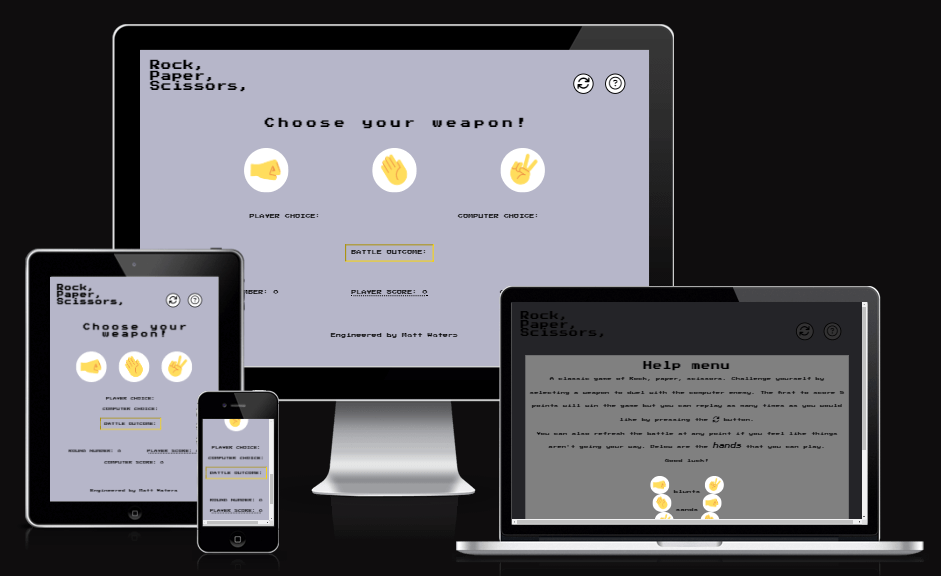

## User Experience(UX)

- ### User Stories
- #### First Time Visitor

  1. I want to easily understand the website purpose and play the game.
  2. I want to access information on background and rules of the game.
  3. I want to be able to navigate through the page.

- #### Returning Visitor

  1. I want to achieve the above goals more quickly, fluidly and intuitively.
  2. I want to be able to immediately play a game.
  3. I want to access the developers other library of projects.

- #### Frequent Visitor

  1. I want to be able to immediately play a game.

## Existing site features

- F01 Landing page

This is the landing page where the used can immediately see the game set out as well as the help button and refresh button. The page has been designed with a simple, balanced stylisation. It also uses an 8 bit style text font to playfully contextualise the traditionally physical game in a digital world. The page is fully responsive for all screen sizes so that the game can be enjoyed anywhere and by any player.

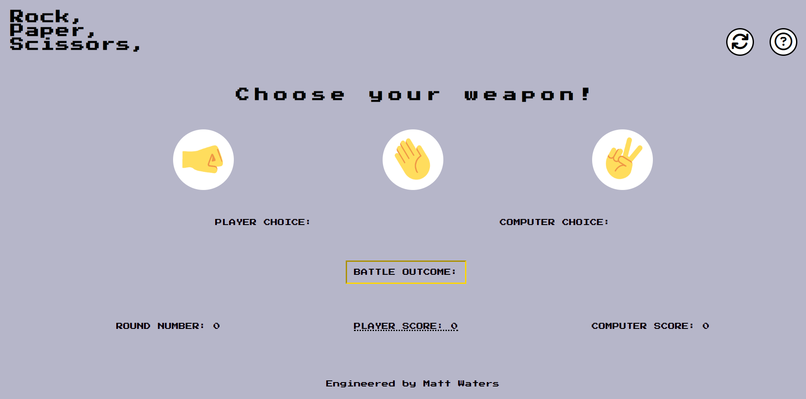

- F02 Header

The header is simply set out with the game name set to the left to orientate the player. To the right are two buttons that are interactive. The refresh button allows the player to reset the game at any time in order to replay. The help button brings up a modal overlay screen that contains rule and game information. The refresh button has JavaScript sitting under it that resets all of the outputs in the arena and result area once clicked.

- F03 & F12 Weapon choice & button hover

The weapon choice section lays out 3 buttons for the player to choose an option from. The buttons are interactive when hovered over. They trigger the game to run a computer selection to be made. Whilst a feature of all the buttons, here we demonstrate how the user can interact with them further as the buttons across the site have a range of features that increase their size, change their colour or underline them. The weapon choice, refresh and help button also have a title that appears when the user hovers over them for more clarity on what they do. All buttons are accessible with the aria-label tag.

- F04 Arena and result sections

The arena section is set out to clearly show the player and computer choice once selecte for each round. The outcome is highlighted by an inset border box that draws the users attention. As each round progresses the choices made are updated, as is the outcome when the player and computer choices are compared in JavaScript.

The result section is similarly set out with outputs that update the player and computer score. The rounds are also updated so that the player can track how many turns have been taken in their battle against the computer. The player score is underlined for better UX experience as it allows the player to always be able to immediately orientate to their score in the battle. The layouts are intended to provide the information in a accessible way that does not distract or disorientate the player.

- F05 Footer

The footer is located at the bottom of the landing page view and allows the user to explore the developer's other projects if they are interested after playing the game. Whilst not directly contributing to the game itself, this adds an extra UX element as it connects the game to a wider menu of offers that the user might be interested in exploring. The embedded link is styled to indicate when hovered over.

- F06 Help modal

The help modal is accessed through the button in the header. It contains some information about the background to the game that aims to speak directly to the user. Whilst the user might be familiar with the game they may want some additional information so there is also a legend included showing the different hands that can be played. The modal contains this information as it might clutter the landing page and it is assumed that the majority of users would be immediately familiar with the concept of the game so having this in a more prominent location on the site might be superfluous. The button at the bottom of the modal returns the user to the landing page to play the game. The modal can be accessed at any point during the game.

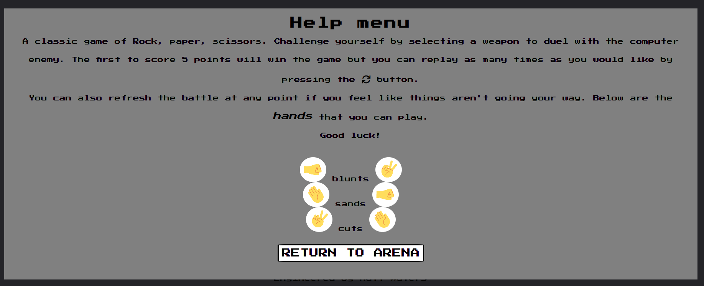

- F07, F08, F09 Player wins, computer wins and draw

These screens show when the player has won a hand, the computer has won a hand, or when the hand is a draw. The outcomes are outputted in the outcome section. The respective scores are updated, as well as the round score. Only the round score is updated in the event of a draw.

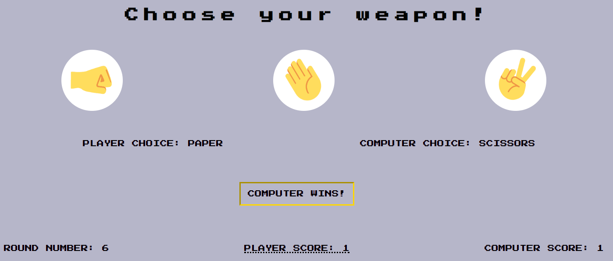

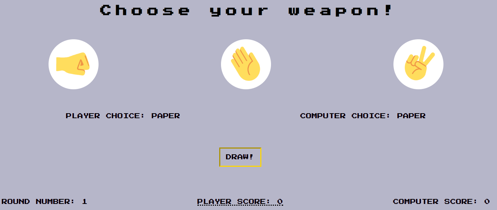

- F10, F11 Player and computer game over screens

These screens show the end game result once a score of 5 has been reached by either the player or computer. The outcome message is updated with a larger text size to either read "You are a weiner" (intentional, playful joke to give the user some interaction and consider, "have they really won or do they want to play the computer again as it is mocking them") or "computer wins : (", again providing a playful interaction for the user so that they are encouraged to subconsciously play again without being deterred due to a harsh output if the computer won. The game ends at these output screens and JavaScript is used to remove the evnt listeners on the player weapon buttons so that no more choices can be made. The refresh button then allwos the user to easily reset the game if they wish to play again, clearing all the outputs and reinstating the player choice functionality.

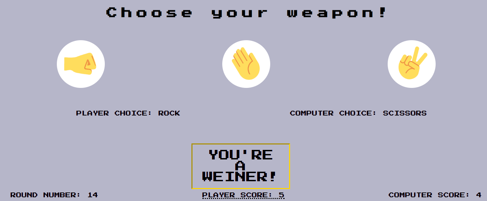

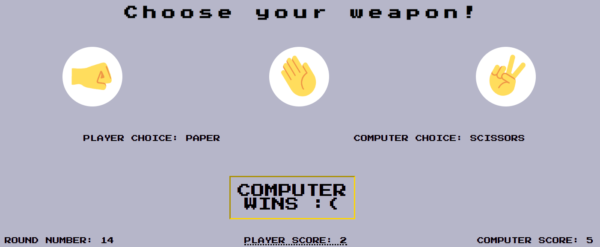

## User story interaction with features

The site has been designed to work through the anticipated ranking of need and desires of users from first time visitors to regular users, recognising needs and wants differ. The design and priority of features is intended to provide the information that users would require to make play the game and make an emotional connection to a gaming world. The flow through the site is intended to allow new users to find out more game information and rules whilst not cluttering the landing page. The buttons are styled with hover features to draw attention of the user and provide feedback during use, as are the output sections.

## Features for future consideration and development

- More interaction for the user with the output sections appearing as pop ups that brings a bit more depth to the site;
- Styling of the score outputs to highlight that they are being incremented;
- An element that decreases the player score when the computer scores to increase the challenge, maybe as an option that more advanced users can select;
- Addition of "lizard" and "spock" hands to create more variation in the game play through choice;
- Add 8 bit background music that plays to increase excitement and suspense, this being responsive to player or computer choices.

## Design

### Imagery & Icons

As stated, the font, images and iconography are styled and employed to connect with users who are existing gamers (e.g. dice 10 for favicon as this is associated with gamers) or to make orientation quicker and so facilitate access and engagement e.g. images used for the player weapon buttons are large and clearly show what they correspond to. The font is probably the main feature that styles the traditional game in a playful, 8 bit world particularly that of the indie gaming scene.

### Colours and scheme

Consistent colour choices were made to make the site and game more accessible visually and aid with elements being prominent. With the contrasting colour, output indicators and imagery usage it was completely necessary to use other structural elements to establish different sections but this is something that could be explored further in future development.

## Wireframe sketches

These defined the basic concept that initially did start out with "lizard" and "spock" hands included but as the game was developed the scope was refined. Images used were just place holders at the time of scoping and the layout was further refined with development and testing.

### Landing page

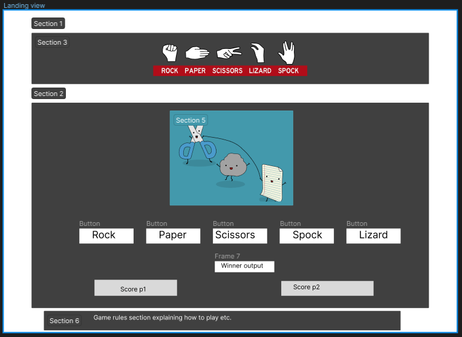

### Turns and scoring sections

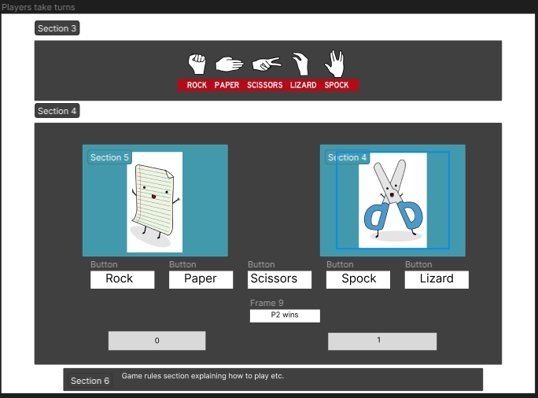

### Game over outcome

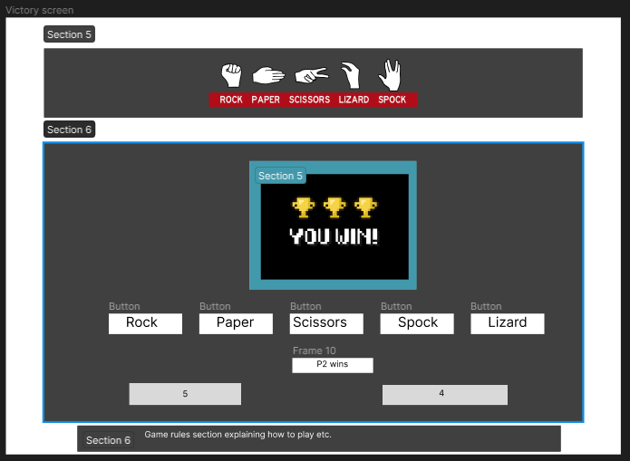

## Technologies employed

### Development languages

- [HTML5](https://en.wikipedia.org/wiki/HTML5)
- [CSS3](https://en.wikipedia.org/wiki/CSS)
- [JavaScript](https://en.wikipedia.org/wiki/JavaScript)

### Libraries, frameworks and programs

- [Swampview](https://swampview.com/rock-paper-scissors-lizard-spock-rules/): this was used to access images for the rock, paper, scissors hands. All credit for these images goes to Tony Florida. This site is not for commercial purposes, only educational.
- [Font Awesome](https://fontawesome.com/): this was used to access icons for design purposes.
- [Google Fonts](https://fonts.google.com/): "Press Start2P" font was downloaded and imported to be applied across the project for styling purposes.
- [Code Anywhere](https://codeanywhere.com/): this was used for version control via the terminal to commit to Code Anywhere and Push to GitHub as the repository.
- [GitHub](https://github.com/): this was used as a repository for projects that were committed from Code Anywhere.
- [Tiny PNG](https://tinypng.com/): this was used to compress files for inclusion.
- [Am I responsive](https://ui.dev/amiresponsive): used to test responsivity of site.
- [Figma](https://www.figma.com/): used to create wireframes at scoping stage.

## Validation

- The site has been validated in [HTML Validator](https://validator.w3.org/). The HTML is valid at the time of writing as demonstrated below:

There were only a couple of errors that were corrected before launch, namely removal of a redundant button id.

- The site has been validated in [CSS Validator](https://jigsaw.w3.org/css-validator/). The CSS is valid at the time of writing as demonstrated below:

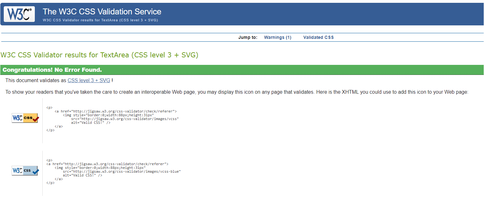

There were a number of errors relating to syntax issues that were fixed by the developer before deployment, namely correcting a missing pixel value on a responsivity rule and correcting missing tansform function.

- The site has been validated in [JS Hint](https://jshint.com/). The JS is valid at the time of writing as demonstrated below:

JS Hint had to be configured to ES6 which removed a series of warnings related to elements like "constants". The developer removed unnecessary semi-colons.

## Lighthouse accessibility test

[Google's web.dev page quality test](https://web.dev/measure/) was used to measure the website against performance, accessibility, SEO and best practice.

### Performance

As the performance score is lower than desired the following steps are some of the approaches that could be considered to address this in the future:

- reduce weight of pages;
- increase speed of servers;
- or better render blocking resources.

### Accessibility

- The read out shows good results apart from in best practice. The issues could not be resolved by the developer prior to launch due to imagery origin formatting but will be revisited post deployment.

### Best Practice

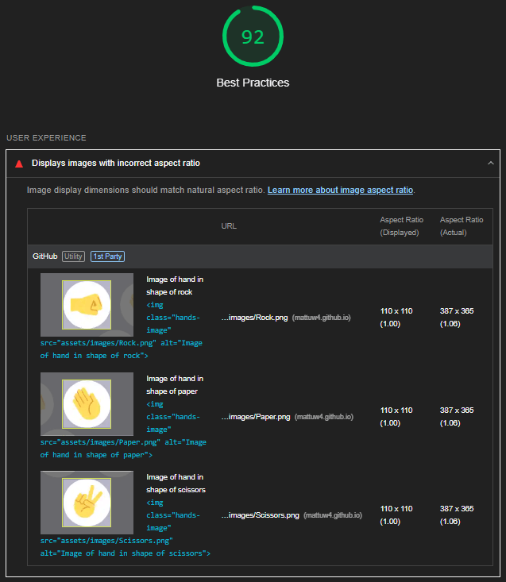

## Browser compatibility and responsivity

The site has been tested on the following browsers with no issues identified at the time of testing:

- Firefox 113.0.2 (64 bit)
- Edge 113.0. 1774.35 (64 bit)
- Chrome 113.0. 5672.64 (64 bit)
- Safari 16.4.1

The site has been developed to be responsive at:

- larger to medium screen sizes from 1200px wide and down;
- 1075px and down;
- medium to smaller screen sizes from 950px wide and down;
- 725px and down;
- 650px and down;
- 590px and down;
- and smaller screen sizes from 375px wide and down.

## Scenario testing and results

The following details the tests that were set out and completed for the site:

The 404 page was tested using with no issues identified although the developer was unable to view the 404 page before deployment [404 Checker](https://websiteadvantage.com.au/404-Error-Handler-Checker)

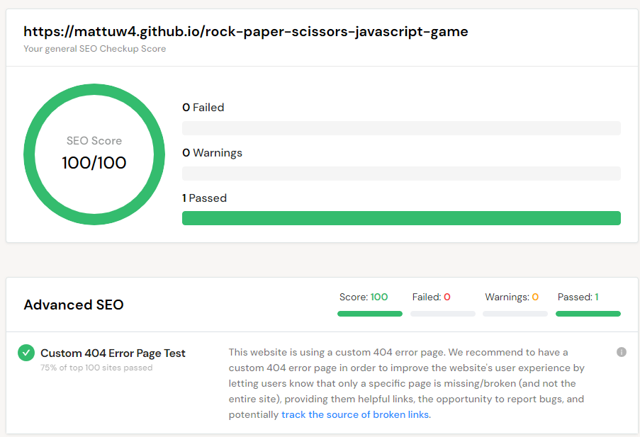

# Known bugs

- Within Code Anywhere there is a warning notification of "Import statements do not load in parallel". This has been explored with support and is understood to relate to potential perforaance issues if there were a style sheet opened or linked to the style sheet within this project. As this is not a feature of this project, the warning is not thought to be significant at this time.
- It has been noted that occasionally on some mobile devices the outcome section can overlay the results sectionw when the endgame message is displayed. This has been styled to avoid with CSS but the problem intermittently persists so will be revisited.
- The formatting of the header has been noted to not layout correctly on one mobile device, despite styling to correct.

## Deployment

### Deployment of site

- In the GitHub repository, select the Settings tab;
- Select the Pages tab from the left hand menu;
- Under the branch section select 'main' branch. This will display a message to indicate deployment if completed successfully;
- Any subsequent changes to the project will take effect on the live page;
- A live link to the functional site can be found here [View the live project here](https://mattuw4.github.io/Rock-paper-scissors-JavaScript-game/).

### Cloning the repository

- Navigate to the repository <https://mattuw4.github.io/Rock-paper-scissors-JavaScript-game/> on GitHub;
- Above the list of files, click Code;
- Copy the URL for the repository by selecting HTTPs;
- Open Git Bash;
- Change the current working directory to the location where you want the cloned directory;
- Type 'git clone', and then paste the URL you copied earlier;
- Press Enter to create your local clone.

### Forking a project

- A fork is a new repository that shares code and visibility settings with the original “upstream” repository.
- On GitHub.com, navigate to the relevant repository;
- In the top-right corner of the page, click Fork;
- Under "Owner," select the dropdown menu and click an owner for the forked repository;
- By default, forks are named the same as their upstream repositories. Optionally, to further distinguish your fork, in the "Repository name" field, type a name;
- Optionally, in the "Description" field, type a description of your fork;
- Optionally, select Copy the DEFAULT branch only;
- For many forking scenarios, such as contributing to open-source projects, you only need to copy the default branch. If you do not select this option, all branches will be copied into the new fork;
- Click Create fork.

### Any change made to the site should be committed and pushed to GitHub within your IDE terminal

- Using the 'Git Add' command move files to the staging area;
- Using the 'Git Commit' command take a snapshot of the current state of your repository;
- The git commit command requires a commit message that describes the snapshot/changes that you made in that commit;
- Use the 'Git Push' command to push the files to the GitHub repository;
- As the site is live changes will take effect there.

## Credits

### Content

- All content was written by the developer for this site. Styling and layout are the users own work.

### Code

Within the code files there are comments to indicate where the below resources were used as a basis to inform the code that was ultimately produced to style the site.

- Code on how to use flex box and implement for ordering purposes was informed by resources from [CSS Tricks](https://css-tricks.com/snippets/css/a-guide-to-flexbox/).
- Tutorials on how to develop a rock, paper, scissors were referred to and are available at [Web Dev Simplified](https://www.youtube.com/watch?v=1yS-JV4fWqY), [Geek for geeks](https://www.geeksforgeeks.org/rock-paper-and-scissor-game-using-javascript/), [Mozilla Development Network](https://developer.mozilla.org/en-US/docs/Web/JavaScript) and [Code with Faraz](https://www.codewithfaraz.com/content/107/create-rock-paper-scissors-game-with-html-css-and-javascript)
- A tutorial on how to create a modal was used to develop the modal page [W3Schools](https://www.w3schools.com/howto/howto_css_modals.asp)
- The Love Maths project from the Code Institute was also used to inform development of the JavaScript

### Media

- The icons used in the modal and refresh buttons taken from [Font Awesome](https://fontawesome.com/)
- The font used across the site was taken from [Google Fonts](https://fonts.google.com/)
- All images were accessed from [Swampview](https://swampview.com/rock-paper-scissors-lizard-spock-rules/): this was used to access images for the rock, paper, scissors hands. All credit for these images goes to Tony Florida. This site is not for commercial purposes, only educational.

## Acknowledgements

Thanks to my mentor Brian Macharia who provided essential, indispensible reassurance and input with the project development and implementation.
